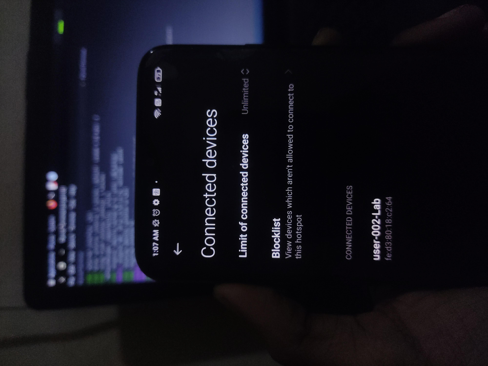

# ID0 — Identity Zero

<p align="center">
  <a href="https://www.gnu.org/licenses/gpl-3.0">
    
  </a>
  
  
  <a href="https://github.com/cxuri/id0/pulls">
    
  </a>
</p>

---

## Overview

ID0 is a network identity management system for Linux that automates MAC address and hostname rotation. Designed for security professionals and privacy-conscious users.

### Core Features

- **MAC Address Rotation** – Automated cycling of network interface identifiers
- **Hostname Management** – Dynamic hostname changes with DHCP integration
- **NetworkManager Compatibility** – Seamless integration with modern network management
- **Log Management** – System log cleaning and activity tracking
- **Scheduled Rotation** – Configurable timing intervals
---

## Installation

```bash
git clone https://github.com/cxuri/id0.git
cd id0
chmod +x install.sh
sudo ./install.sh
```


## Quick Start ( Without Installation)

```bash
git clone https://github.com/cxuri/id0.git
cd id0/bin
chmod +x id0.sh
sudo id0.sh
```
---


## Command Reference

| Command | Description | Privileges |
|---------|-------------|------------|
| `start [interface] [minutes]` | Begin identity rotation | Root |
| `revert [interface]` | Restore original identity | Root |
| `status` | Show current status | User |
| `backup` | Backup current configuration | User |
| `interfaces` | List network interfaces | User |
| `fix-networkmanager` | Apply compatibility fixes | Root |
| `logs` | View activity logs | User |

**Examples:**
```bash
sudo ./id0.sh start eth0 10      # Rotate every 10 minutes
./id0.sh status                  # Check rotation status
sudo ./id0.sh revert wlan0       # Restore original identity
```

---

## Interface & Screenshots

<p align="center">
  
  
  <br>
  
  
</p>

---

## System Requirements

- **OS**: Linux
- **Shell**: Bash 5.x+
- **Network Manager**: NetworkManager (recommended)
- **Privileges**: Root access for network configuration

---

## Usage Guidelines

- Create backups before starting rotation
- Test in controlled environments first
- Monitor system logs for issues
- Combine with VPN for enhanced privacy
- Ensure legal compliance for your use case

---

## Legal Notice

ID0 is intended for:
- Security research and testing
- Privacy protection
- Network administration
- Educational purposes

**Prohibited uses include:**
- Unauthorized network access
- Illegal activities
- Network disruption

Users are responsible for complying with local laws and regulations.

---

## License

GNU General Public License v3.0 - See [LICENSE](LICENSE) for details.

---

## Resources

- **Source**: [github.com/cxuri/id0](https://github.com/cxuri/id0)
- **Issues**: [GitHub Issues](https://github.com/cxuri/id0/issues)

---

**ID0 — Professional network identity management**
